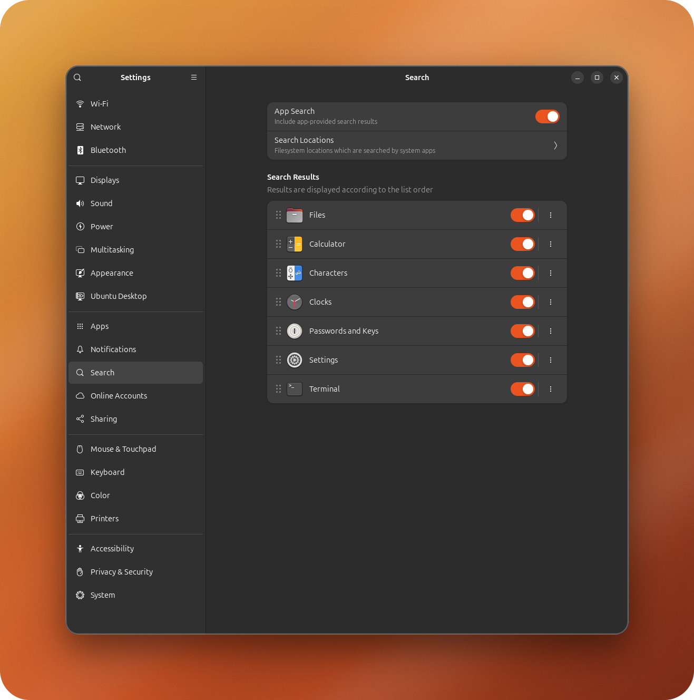
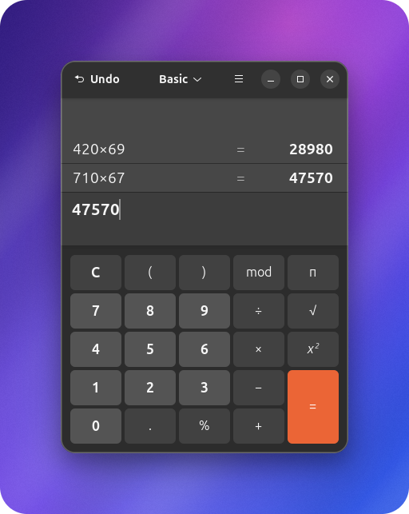

<h1 align="center">Cloche</h1>

<p align="center">
  <em>Open-source desktop capture for polished shots, short reels, and agent workflows.</em>
</p>

<p align="center">
  <a href="https://github.com/escoffier-labs/cloche/actions/workflows/ci.yml"></a>
  <a href="https://github.com/escoffier-labs/cloche/releases"></a>
  
  
  
  
  <a href="LICENSE"></a>
</p>

<p align="center">
  
</p>

<p align="center">
  
</p>

Cloche is an open-source desktop capture tool for people and agents. It captures the active app or window, writes polished artifacts plus metadata, and prints stable JSON so scripts, local tools, and AI agents can all use the same command.

The name comes from the glass or silver dome used to present something cleanly. Cloche lifts what is on your screen, frames it, and makes it ready to share.

The first production mode is **Shots**: polished screenshots with raw files, metadata, optional text extraction, and gallery helpers. The roadmap adds **Reels** for short screen recordings, then **GIF export** for lightweight loops.

This repo started as `appshots`. The `appshots` binary remains as a compatibility alias while `cloche` becomes the primary command.

## Current Capabilities

- Captures the active window, a selected window, or the full screen.
- Writes `shot.png`, `metadata.json`, optional `text.txt`, and a polished `shot-card.png`.
- Emits stable JSON on stdout for agents and automation.
- Extracts best-effort visible or accessible app text when the OS exposes it.
- Provides `gallery`, `latest`, and `preview` helpers for capture history.
- Runs directly as a CLI, or as a small stdio MCP server through `cloche mcp`.
- Keeps `appshots` as a compatibility command during the rename.

## Modes

**Shots** are available now. A Shot is a still capture with raw and presentation images, metadata, and optional extracted text.

**Reels** are planned next. A Reel will be a short desktop recording with the same Cloche presentation system, cursor emphasis, captions, and stable metadata. The existing Appreels prototype is the starting point for this mode.

**GIF export** is planned after Reels. GIFs will be generated from finished Reels as a delivery format, not recorded as the primary source format.

## Why Cloche Exists

OpenAI documents Appshots as a macOS app feature for Codex. The Codex repository can already resume threads that contain local images through app-server v2 `turn/start` input:

```json
{ "type": "localImage", "path": "/absolute/path/to/shot.png", "detail": "high" }
```

Linux and Windows users still need a reliable way to create those captures from a normal CLI. Cloche fills that capture side while staying independent of any one agent stack. Use it with Codex, OpenClaw, Claude Code, Hermes, a local MCP client, or a plain shell script.

Reference: <https://developers.openai.com/codex/appshots>

## Install

Install the latest release from crates.io:

```bash
cargo install cloche
```

Build and install from a local checkout:

```bash
cargo install --path . --bins
```

Or use the install script:

```bash
bash scripts/install.sh
```

On Windows:

```powershell
powershell -ExecutionPolicy Bypass -File scripts/install.ps1
```

## Quick Start

Capture the active app or window as a Shot:

```bash
cloche capture --target active --out-dir /tmp/cloche-shot-$(date +%s) --format json
```

Preview the latest capture:

```bash
cloche preview
```

Create a self-contained HTML gallery of recent Shots:

```bash
cloche gallery --root /tmp --html /tmp/cloche.html --title "My Shots" --open
```

Generate a Codex `turn/start` payload from a Shot:

```bash
cloche codex-payload --thread-id "$THREAD_ID" /tmp/cloche-shot-123
```

## Command Reference

```bash
cloche doctor --format json
cloche list-windows --format json
cloche capture --target active --presentation both --out-dir /tmp/cloche-shot --format json
cloche capture --target active --style-seed 12345 --out-dir /tmp/cloche-shot --format json
cloche capture --target screen --out-dir /tmp/cloche-shot --format json
cloche capture --target window --title Firefox --out-dir /tmp/cloche-shot --format json
cloche gallery --limit 10
cloche gallery --root /tmp --html /tmp/cloche.html --title "My Shots" --open
cloche latest
cloche preview
cloche open /tmp/cloche-shot
cloche schema
cloche codex-payload --thread-id THREAD_ID /tmp/cloche-shot
cloche mcp
```

The old `appshots` command remains as an alias for the same code path.

## Output Files

Each successful Shot directory contains:

- `shot.png`, the raw captured image.
- `shot-card.png`, a presentation image with background cleanup, rounded corners, padding, and a soft shadow.
- `metadata.json`, the same JSON object printed to stdout.
- `text.txt`, optional best-effort accessible text from the focused app.

Capture exits with `0` only when a raw image was written. Text extraction and presentation-image failures are warnings because accessibility support and desktop compositing vary by toolkit, app, desktop environment, and OS. `--target screen` exists as a fallback and debugging mode. `--target active` is the default.

Use `--presentation raw`, `--presentation card`, or `--presentation both` to control output image generation. Use `--style-seed <number>` to reproduce a randomized card style exactly.

## Agent Use

Any shell-capable agent can call:

```bash
cloche capture --target active --out-dir /tmp/cloche-shot-$(date +%s) --format json
```

Then parse `image.path` from stdout or read the generated `metadata.json`.

Codex app-server clients can turn a capture into a ready `turn/start` payload:

```bash
cloche codex-payload --thread-id "$THREAD_ID" /tmp/cloche-shot-123
```

Other agents should treat Cloche as a normal subprocess tool. The core command has no MCP dependency, desktop-app dependency, or agent-specific runtime dependency.

## MCP Server

`cloche mcp` runs a minimal stdio MCP server for clients that prefer the Model Context Protocol over direct subprocess calls. It speaks newline-delimited JSON-RPC 2.0 on stdin/stdout and exposes `capture`, `list_windows`, `doctor`, `latest`, and `gallery` as tools. Each tool call shells out to the same binary, so the JSON contract is identical to the CLI.

Register it like any stdio MCP server:

```json
{
  "mcpServers": {
    "cloche": { "command": "cloche", "args": ["mcp"] }
  }
}
```

Compatibility config:

```json
{
  "mcpServers": {
    "appshots": { "command": "appshots", "args": ["mcp"] }
  }
}
```

## Linux Backend Notes

- X11 active/window capture uses `xdotool`/`wmctrl` for window metadata and ImageMagick `import` for PNG capture.
- Wayland wlroots screen capture uses `grim`.
- GNOME/KDE Wayland may block silent active-window capture by design. Use `--target screen` or run `cloche doctor --format json` for diagnostics.
- Text extraction is best-effort through AT-SPI using Python GI when available.

If you are invoking Cloche from SSH, a TTY, or an agent process that did not inherit the desktop environment, Cloche will try to discover the live desktop variables from desktop processes. On GNOME X11 they usually look like:

```bash
export DISPLAY=:1
export XAUTHORITY=/run/user/$(id -u)/gdm/Xauthority
export DBUS_SESSION_BUS_ADDRESS=unix:path=/run/user/$(id -u)/bus
export XDG_SESSION_TYPE=x11
```

You can discover the active values from a desktop process:

```bash
tr '\0' '\n' </proc/$(pgrep -u "$(id -u)" -n gnome-shell)/environ | grep -E '^(DISPLAY|XAUTHORITY|DBUS_SESSION_BUS_ADDRESS|XDG_SESSION_TYPE)='
```

## Windows Backend Notes

- Active/window capture uses Win32 foreground-window and top-level-window metadata, then captures the target window with `PrintWindow` so covered windows are not polluted by whatever is on top. It falls back to `.NET CopyFromScreen` if `PrintWindow` is unavailable for that window.
- Screen capture uses the Windows virtual screen.
- Text extraction is best-effort through UI Automation.
- Capture must run in a logged-in interactive desktop session. Plain OpenSSH sessions can build and run `doctor`, but Windows blocks screen capture from the non-interactive SSH service session.

## Gallery HTML Export

`cloche gallery --html <path>` writes a single self-contained HTML file with each capture's image embedded inline, so the result can be shared without any companion files. Combine with `--root`, `--limit`, `--title`, and `--open`. The JSON output gains an `htmlPath` field pointing at the written file.

## Release Packaging

Build a local release archive:

```bash
bash scripts/package-release.sh
```

On Windows:

```powershell
powershell -ExecutionPolicy Bypass -File scripts/package-release.ps1
```

Archives are written under `dist/`. Tagged GitHub releases are packaged by `.github/workflows/release.yml` for Linux and Windows.

## Roadmap

See [ROADMAP.md](ROADMAP.md).
